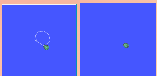

# openEUler上的ROS Humble测试文档

# 安装ROS2

[参考open Euler ROS Humble安装文档](https://openeuler-ros-docs.readthedocs.io/en/latest/installation/install-ros-humble.html)

# 基础CLI

## 环境配置

### 获取安装文件

每次打开新的终端时都需要使用命令source /opt/ros/humble/setup.bash，或者把命令添加到.bashrc当中去。

```
echo "source /opt/ros/humble/setup.bash" >> ~/.bashrc
```

### 检测环境变量

输入printenv | grep -i ROS后查看是否已经设置

```
ROS_VERSION=2
ROS_PYTHON_VERSION=3
ROS_DISTRO=humble
```

## 测试

迅速了解和学习ROS2可以使用turtlesim。

### 安装turtlesim

```
sudo yum update
sudo yum install ros-humble-turtlesim
```

### 启动turtlesim

输入以下命令：

```
ros2 run turtlesim turtlesim_node
```

便会跳出一个窗口，里面刷新了一只海龟。


此时再开一个终端，并输入命令ros2 run turtlesim turtle_teleop_key便可以使用键盘上的方向键控制海龟了。

同时也可以使用下面几个命令查看相关信息

```
ros2 node list
ros2 topic list
ros2 service list
ros2 action list
```

### 安装rqt

打开新的终端安装

```
sudo yum update
sudo yum install 'ros-humble-rqt*'
```

### 使用rqt

运行：

```
rqt
```

从顶部的菜单栏中选择 Plugins > Services > Service Caller。

随后可以点击service列表，查看turtlesim服务，并选择/spawn

## 了解并测试节点

### 什么是节点

ROS 中的每个节点都应该负责一个单一的模块化目的。 每个节点都可以通过主题、服务、作或参数从其他节点发送和接收数据。一个完整的机器人系统由许多协同工作的节点组成。 在 ROS 2 中，单个可执行文件（C++ 程序、Python 程序等）可以包含一个或多个节点。

### 测试

#### 节点列表

使用ros2 run来启动可执行文件。

```
ros2 run <package_name> <executable_name>
```

就像先前运行的turtlesim一样。运行的ros2 run turtlesim turtlesim_node命令。

当我们想要知道当前所有正在运行的节点名称的时候，可以使用命令

```
ros2 node list
```

在我运行turtlesim的情况下会输出

```
/turtlesim
```

另开一个窗口，运行命令ros2 run turtlesim turtle_teleop_key，再次运行命令ros2 node list，可得到：

```
/teleop_turtle
/turtlesim
```

#### 重映射

通过重新映射，可以将默认节点属性（如节点名称、主题名称、服务名称等）重新分配给自定义值。

运行了/turtlesim后再运行如下命令：

```
ros2 run turtlesim turtlesim_node --ros-args --remap __node:=my_turtle
```

会再开一个turtlesim窗口，这时候运行命令ros2 node list可得到：

```
/my_turtle
/teleop_turtle
/turtlesim
```

#### 节点信息

ros2 node info <node_name>这个命令可以访问更多有关节点的信息，返回订阅者、发布者、服务和作的列表。

就像我要检查最新节点便运行：

```
ros2 node info /my_turtle
```

便得到了：

```
/my_turtle
  Subscribers:
    /parameter_events: rcl_interfaces/msg/ParameterEvent
    /turtle1/cmd_vel: geometry_msgs/msg/Twist
  Publishers:
    /parameter_events: rcl_interfaces/msg/ParameterEvent
    /rosout: rcl_interfaces/msg/Log
    /turtle1/color_sensor: turtlesim/msg/Color
    /turtle1/pose: turtlesim/msg/Pose
  Service Servers:
    /clear: std_srvs/srv/Empty
    /kill: turtlesim/srv/Kill
    /my_turtle/describe_parameters: rcl_interfaces/srv/DescribeParameters
    /my_turtle/get_parameter_types: rcl_interfaces/srv/GetParameterTypes
    /my_turtle/get_parameters: rcl_interfaces/srv/GetParameters
    /my_turtle/list_parameters: rcl_interfaces/srv/ListParameters
    /my_turtle/set_parameters: rcl_interfaces/srv/SetParameters
    /my_turtle/set_parameters_atomically: rcl_interfaces/srv/SetParametersAtomically
    /reset: std_srvs/srv/Empty
    /spawn: turtlesim/srv/Spawn
    /turtle1/set_pen: turtlesim/srv/SetPen
    /turtle1/teleport_absolute: turtlesim/srv/TeleportAbsolute
    /turtle1/teleport_relative: turtlesim/srv/TeleportRelative
  Service Clients:

  Action Servers:
    /turtle1/rotate_absolute: turtlesim/action/RotateAbsolute
  Action Clients:
```

## 了解并测试主题

### 什么是主题

主题是数据在节点之间移动的主要方式之一，因此也是在系统的不同部分之间移动数据的主要方式之一。一个节点可以将数据发布到任意数量的主题，同时订阅任意数量的主题。

### 测试

#### 主题列表

先打开两个终端运行命令ros2 run turtlesim turtlesim_node和ros2 run turtlesim turtle_teleop_key，然后输入以下命令将返回系统中当前活动的所有主题的列表。

```
ros2 topic list
```

返回：

```
/parameter_events
/rosout
/turtle1/cmd_vel
/turtle1/color_sensor
/turtle1/pose
```

#### 主题回声

查看有关某个主题发布的数据ros2 topic echo <topic_name>，就像先前使用ros2 topic list返回了/turtle1/cmd_vel，接下来使用该命令可以查看返回的数据。

```
ros2 topic echo /turtle1/cmd_vel
```

执行该命令一开始是没有数据返回，因为在等数据的发布。在执行了ros2 run turtlesim turtle_teleop_key命令的终端底下使用键盘，便能看到发布的数据了，例：

```
linear:
  x: 0.0
  y: 0.0
  z: 0.0
angular:
  x: 0.0
  y: 0.0
  z: -2.0
---
```

#### 主题信息

主题不必只是一对一的交流;它们可以是一对多、多对一或多对多。

在不退出之前程序的情况下使用命令查看/turtle1/cmd_vel的情况。

```
ros2 topic info /turtle1/cmd_vel
```

返回：

```
Type: geometry_msgs/msg/Twist
Publisher count: 1
Subscription count: 2
```

#### 接口显示

节点使用消息通过主题发送数据。 发布者和订户必须发送和接收相同类型的消息才能进行通信。

在上个测试中返回了Type: geometry_msgs/msg/Twist，便可以使用命令查看该消息需要什么具体的数据结构。

```
# This expresses velocity in free space broken into its linear and angular parts.

Vector3  linear
	float64 x
	float64 y
	float64 z
Vector3  angular
	float64 x
	float64 y
	float64 z
```

其与ros2 topic echo /turtle1/cmd_vel命令返回的数据一一对应。

#### 主题pub

拥有了消息结构，可以使用以下方法直接从命令行将数据发布到主题：ros2 topic pub <topic_name> <msg_type> '<args>'

像我现在执行如下命令，就会以1Hz的稳定流发布命令。

```
ros2 topic pub /turtle1/cmd_vel geometry_msgs/msg/Twist "{linear: {x: 2.0, y: 0.0, z: 0.0}, angular: {x: 0.0, y: 0.0, z: 1.8}}"
```

可看见小乌龟沿着圆圈转，同时也可以选择参数：

--once：表示 “发布一条消息，然后退出”。

-w 2：表示 “等待两个匹配的订阅”。 这是必需的，因为我们同时订阅了 turtlesim 和 echo 主题。

例：ros2 topic pub --once -w 2 /turtle1/cmd_vel geometry_msgs/msg/Twist "{linear: {x: 2.0, y: 0.0, z: 0.0}, angular: {x: 0.0, y: 0.0, z: 1.8}}"

。

#### 主题HZ

查看数据发布速率，返回有关节点将数据发布到主题的速率的数据。例如使用如下命令：

```
ros2 topic hz /turtle1/pose
```

输出：

```
average rate: 60.235
	min: 0.010s max: 0.052s std dev: 0.00472s window: 62
average rate: 61.357
	min: 0.010s max: 0.052s std dev: 0.00337s window: 125
```

#### 主题BW

查看主题使用的带宽，返回带宽利用率和发布到主题的消息数

```
ros2 topic bw /turtle1/pose
```

返回：

```
Subscribed to [/turtle1/pose]
1.52 KB/s from 63 messages
	Message size mean: 0.02 KB min: 0.02 KB max: 0.02 KB
1.50 KB/s from 100 messages
	Message size mean: 0.02 KB min: 0.02 KB max: 0.02 KB
1.51 KB/s from 100 messages
```

#### 主题查找

列出给定类型的可用主题列表，可使用ros2 topic find <topic_type>例如：

```
ros2 topic find geometry_msgs/msg/Twist
```

返回：

```
/turtle1/cmd_vel
```

## 了解并测试服务

### 什么是服务

服务是 ROS 图中节点的另一种通信方法。 服务基于主题的呼叫和响应模型，而不是发布者-订阅者模型。 虽然主题允许节点订阅数据流并获得持续更新，但服务仅在客户端专门调用时提供数据。

### 测试

先启动两个终端，两个命令：ros2 run turtlesim turtlesim_node、ros2 run turtlesim turtle_teleop_key

#### 服务列表

新终端中运行该命令将返回系统中当前活动的所有服务的列表。

```
ros2 service list
```

返回：

```
/clear
/kill
/reset
/spawn
/teleop_turtle/describe_parameters
/teleop_turtle/get_parameter_types
/teleop_turtle/get_parameters
/teleop_turtle/list_parameters
/teleop_turtle/set_parameters
/teleop_turtle/set_parameters_atomically
/turtle1/set_pen
/turtle1/teleport_absolute
/turtle1/teleport_relative
/turtlesim/describe_parameters
/turtlesim/get_parameter_types
/turtlesim/get_parameters
/turtlesim/list_parameters
/turtlesim/set_parameters
/turtlesim/set_parameters_atomically
```

#### 服务类型

服务具有描述服务的请求和响应数据结构的类型。 服务类型的定义与主题类型类似，但服务类型包含两个部分：一个消息用于请求，另一个用于响应。使用ros2 service type <service_name>命令了解服务类型。例：

```
ros2 service type /clear
```

返回：

```
std_srvs/srv/Empty
```

#### 服务列表-t

```
ros2 service list -t
```

返回：

```
/clear [std_srvs/srv/Empty]
/kill [turtlesim/srv/Kill]
/reset [std_srvs/srv/Empty]
/spawn [turtlesim/srv/Spawn]
/teleop_turtle/describe_parameters [rcl_interfaces/srv/DescribeParameters]
/teleop_turtle/get_parameter_types [rcl_interfaces/srv/GetParameterTypes]
/teleop_turtle/get_parameters [rcl_interfaces/srv/GetParameters]
/teleop_turtle/list_parameters [rcl_interfaces/srv/ListParameters]
/teleop_turtle/set_parameters [rcl_interfaces/srv/SetParameters]
/teleop_turtle/set_parameters_atomically [rcl_interfaces/srv/SetParametersAtomically]
/turtle1/set_pen [turtlesim/srv/SetPen]
/turtle1/teleport_absolute [turtlesim/srv/TeleportAbsolute]
/turtle1/teleport_relative [turtlesim/srv/TeleportRelative]
/turtlesim/describe_parameters [rcl_interfaces/srv/DescribeParameters]
/turtlesim/get_parameter_types [rcl_interfaces/srv/GetParameterTypes]
/turtlesim/get_parameters [rcl_interfaces/srv/GetParameters]
/turtlesim/list_parameters [rcl_interfaces/srv/ListParameters]
/turtlesim/set_parameters [rcl_interfaces/srv/SetParameters]
/turtlesim/set_parameters_atomically [rcl_interfaces/srv/SetParametersAtomically]
```

#### 服务查找

查找特定类型的所有服务ros2 service find <type_name>。例：

```
ros2 service find std_srvs/srv/Empty
```

返回：

```
/clear
/reset
```

#### 接口显示

使用ros2 interface show <type_name>命令调用服务。例:

```
ros2 interface show std_srvs/srv/Empty
```

返回：

```
---
```

因为该类型不会发送或接收任何数据， 所以它的结构是空白的。如果使用如下命令：

```
ros2 interface show turtlesim/srv/Spawn
```

返回：

```
float32 x
float32 y
float32 theta
string name # Optional.  A unique name will be created and returned if this is empty
---
string name
```

#### 服务调用

使用ros2 service call <service_name> <service_type> <arguments>命令调用服务，例：

```
ros2 service call /clear std_srvs/srv/Empty
```



使用该命令删除了绘制的线条。

如果使用如下命令，窗口中会生成一只新的海龟。

```
ros2 service call /spawn turtlesim/srv/Spawn "{x: 2, y: 2, theta: 0.2, name: ''}"
```

## 了解并测试参数

### 什么是参数

参数是节点的配置值。 您可以将参数视为节点设置。 节点可以将参数存储为整数、浮点数、布尔值、字符串和列表。 在 ROS 2 中，每个节点都维护自己的参数。可以访问[概念文档](https://docs.ros.org/en/humble/Concepts/Basic/About-Parameters.html)查看。

### 测试

先启动两个终端，两个命令：ros2 run turtlesim turtlesim_node、ros2 run turtlesim turtle_teleop_key

#### 参数列表

要查看属于您的节点的参数，请打开一个新终端并输入命令：

```
ros2 param list
```

返回：

```
/teleop_turtle:
  qos_overrides./parameter_events.publisher.depth
  qos_overrides./parameter_events.publisher.durability
  qos_overrides./parameter_events.publisher.history
  qos_overrides./parameter_events.publisher.reliability
  scale_angular
  scale_linear
  use_sim_time
/turtlesim:
  background_b
  background_g
  background_r
  qos_overrides./parameter_events.publisher.depth
  qos_overrides./parameter_events.publisher.durability
  qos_overrides./parameter_events.publisher.history
  qos_overrides./parameter_events.publisher.reliability
  use_sim_time
```

#### 参数get

要显示参数的类型和当前值，请使用ros2 param get <node_name> <parameter_name>命令，例：

```
ros2 param get /turtlesim background_g
```

返回：

```
Integer value is: 86
```

#### 参数集

要在运行时更改参数的值，使用ros2 param set <node_name> <parameter_name> 命令，例如我要更改turtlesim的背景颜色：

```
ros2 param set /turtlesim background_r 150
```

turtlesim的窗口就变成紫色了。

#### 参数转储

使用ros2 param dump <node_name>命令查看节点的所有当前参数值，例：

```
ros2 param dump /turtlesim > turtlesim.yaml
```

使用cat turtlesim.yaml命令查看当前工作目录下的新文件。

```
$cat turtlesim.yaml 
/turtlesim:
  ros__parameters:
    background_b: 255
    background_g: 86
    background_r: 150
    qos_overrides:
      /parameter_events:
        publisher:
          depth: 1000
          durability: volatile
          history: keep_last
          reliability: reliable
    use_sim_time: false
```

#### 参数负载

可以使用ros2 param load <node_name> <parameter_file>命令将参数从文件加载到当前正在运行的节点。例：

```
ros2 param load /turtlesim turtlesim.yaml
```

返回：

```
Set parameter background_b successful
Set parameter background_g successful
Set parameter background_r successful
Set parameter qos_overrides./parameter_events.publisher.depth failed: parameter 'qos_overrides./parameter_events.publisher.depth' cannot be set because it is read-only
Set parameter qos_overrides./parameter_events.publisher.durability failed: parameter 'qos_overrides./parameter_events.publisher.durability' cannot be set because it is read-only
Set parameter qos_overrides./parameter_events.publisher.history failed: parameter 'qos_overrides./parameter_events.publisher.history' cannot be set because it is read-only
Set parameter qos_overrides./parameter_events.publisher.reliability failed: parameter 'qos_overrides./parameter_events.publisher.reliability' cannot be set because it is read-only
Set parameter use_sim_time successful
```

#### 节点启动时保存

要使用保存的参数值启动同一节点，请使用ros2 run <package_name> <executable_name> --ros-args --params-file <file_name>命令。

例如我要保存我turtlesim节点的参数，可以使用以下命令：

```
ros2 run turtlesim turtlesim_node --ros-args --params-file turtlesim.yaml
```

## 了解并测试actions

### 什么是actions

actions是 ROS 2 中的通信类型之一，适用于长时间运行的任务。actions基于主题和服务构建。 它们的功能类似于服务，但可以取消作。 它们还提供稳定的反馈，而不是返回单个响应的服务。actions使用客户端-服务器模型，类似于发布者-订阅者模型。action client节点将目标发送到action server节点，该节点确认目标并返回反馈流和结果。

### 测试

先启动两个终端，两个命令：ros2 run turtlesim turtlesim_node、ros2 run turtlesim turtle_teleop_key

#### 使用actions

在运行ros2 run turtlesim turtle_teleop_key命令时，返回了

```
Use arrow keys to move the turtle.
Use G|B|V|C|D|E|R|T keys to rotate to absolute orientations. 'F' to cancel a rotation.
```

第二行就对应一个actions

#### actions列表

识别ROS中的所有actions使用命令：

```
ros2 action list
```

返回：

```
/turtle1/rotate_absolute
```

#### actions信息

```
ros2 action info /turtle1/rotate_absolute
```

返回：

```
Action: /turtle1/rotate_absolute
Action clients: 1
    /teleop_turtle
Action servers: 1
    /turtlesim
```

#### 接口显示

发送或执行actions目标之前，需要的另一条信息是acitons类型的结构。例：

```
ros2 interface show turtlesim/action/RotateAbsolute
```

返回：

```
# The desired heading in radians
float32 theta
---
# The angular displacement in radians to the starting position
float32 delta
---
# The remaining rotation in radians
float32 remaining
```

此消息中第一个消息上方的部分是目标请求的结构（数据类型和名称）。 下一部分是结果的结构。 最后一部分是反馈的结构。

#### acitons send_goal

使用以下ros2 action send_goal <action_name> <action_type> <values>从命令行发送actions目标。

例：

```
ros2 action send_goal /turtle1/rotate_absolute turtlesim/action/RotateAbsolute "{theta: 1.57}"
```

返回：

```
ction/RotateAbsolute "{theta: 1.57}"
Waiting for an action server to become available...
Sending goal:
     theta: 1.57

Goal accepted with ID: 9d82df52e5fc4729b2f19bce6d5b8625


Result:
    delta: -1.5520000457763672

Goal finished with status: SUCCEEDED
```

且窗口中的小乌龟在旋转。

## 其他CLI

## launch文件

Launch 文件允许您同时启动和配置多个包含 ROS 2 节点的可执行文件。

### 测试

使用下面的命令会运行两个turtlesim节点

```
ros2 launch turtlesim multisim.launch.py
```

multisim.launch.py：

```
from launch import LaunchDescription
import launch_ros.actions


def generate_launch_description():
    return LaunchDescription([
        launch_ros.actions.Node(
            namespace='turtlesim1', package='turtlesim',
            executable='turtlesim_node', output='screen'),
        launch_ros.actions.Node(
            namespace='turtlesim2', package='turtlesim',
            executable='turtlesim_node', output='screen'),
    ])
```

## 记录和播放

ros2 bag是一个命令行工具，用于记录在系统中的主题上发布的数据。 它累积在任意数量的主题上传递的数据，并将其保存在数据库中。 然后可以重播数据以重现测试和实验的结果。

### 测试

先启动两个终端，两个命令：ros2 run turtlesim turtlesim_node、ros2 run turtlesim turtle_teleop_key，创建一个目录来保存录音。

```
mkdir bag_files
cd bag_files
```

#### 选择一个主题

ros2 bag只能在 Topic 中记录已发布消息的数据。 要查看系统主题列表，请打开新终端并运行命令ros2 topic list。我选择了/turtle1/cmd_vel。

```
ros2 topic echo /turtle1/cmd_vel
```

然后在ros2 run turtlesim turtle_teleop_key的终端上操控小乌龟，便能看到数据发布。

#### 行动记录

要记录发布到主题的数据，请使用命令语法ros2 bag record <topic_name>，在您选择的主题上运行此命令之前，请打开一个新终端并移动到您之前创建的目录中，因为 rosbag 文件将保存在您运行它的目录中，也可以同时录制多个主题。例：

```
ros2 bag record /turtle1/cmd_vel
```

现在正在记录有关该主题发布的数据。 返回 teleop 终端并再次移动。

按下Ctrl+C停止录制。

#### bag信息

通过运行ros2 bag info <bag_file_name>命令来查看有关录制内容的详细信息例：ros2 bag info subset

#### 重播

输入命令：ros2 bag play subset

要了解位置数据的发布频率，您可以运行以下命令：

```
ros2 topic hz /turtle1/pose
```

# 客户端

## 创建工作区

工作区是包含 ROS 2 包的目录。 在使用 ROS 2 之前，必须在您计划使用的终端中获取您的 ROS 2 安装工作区。 这使得 ROS 2 的软件包可供您在该终端中使用。

#### 创建新目录

```
mkdir -p ~/ros2_ws/src
cd ~/ros2_ws/src
```

#### 克隆示例

在~/ros2_ws/src目录下运行克隆命令

```
git clone https://github.com/ros/ros_tutorials.git -b humble
```

#### 使用colcon构建工作区

```
colcon build
```

## 软件包

软件包是 ROS 2 代码的组织单位。 如果您希望能够安装代码或与他人共享代码，则需要将其组织在一个包中。 使用包，您可以发布您的 ROS 2 作品并允许其他人轻松构建和使用它。

每个包的结构：

```
cmake：
my_package/
     CMakeLists.txt
     include/my_package/
     package.xml
     src/
python：
my_package/
      package.xml
      resource/my_package
      setup.cfg
      setup.py
      my_package/
```

单个工作区可以包含任意数量的包，每个包都位于其自己的文件夹中。 您还可以在一个工作区中包含不同构建类型的软件包（CMake、Python 等），不能有嵌套包。请在src中创建包。

### 创建包

```
cd ~/ros2_ws/src
```

创建新包

```
cmake：
ros2 pkg create --build-type ament_cmake --license Apache-2.0 --node-name my_node my_package
python：
ros2 pkg create --build-type ament_python --license Apache-2.0 --node-name my_node my_package
```

测试：

```
cmake：
ros2 pkg create --build-type ament_cmake --license Apache-2.0 --node-name my_node my_package
python：
ros2 pkg create --build-type ament_python --license Apache-2.0 --node-name my_node my_package
```

现在src中有一个my_package的新文件夹，运行命令后，终端将返回消息。

### 构建包

```
cd ~/ros2_ws
colcon build
```

要下次仅构建包，可以运行colcon build --packages-select my_package

## 发布者订阅者测试

测试C++

### 创建包

```
cd ~/ros2_ws/src
ros2 pkg create --build-type ament_cmake --license Apache-2.0 cpp_pubsub
```

### 编写publisher节点

```
cd ~/ros2_ws/src/cpp_pubsub/src
wget -O publisher_member_function.cpp https://raw.githubusercontent.com/ros2/examples/humble/rclcpp/topics/minimal_publisher/member_function.cpp
```

#### 添加依赖

```
cd ~/ros2_ws/src/cpp_pubsub
vim package.xml
```

请确保填写<description> 、 <maintainer>和 <license>标签：

```
  <description>TODO: Package description</description>
  <maintainer email="lander@todo.todo">lander</maintainer>
  <license>Apache-2.0</license>
```

在 buildtool 依赖项后添加新行，并粘贴与节点的 include 语句对应的以下依赖项：ament_cmake

```
<depend>rclcpp</depend>
<depend>std_msgs</depend>
```

#### CMakeLists.txt

打开CMakeLists.txt文件，在find_package(ament_cmake REQUIRED)下面添加以下行：

```
find_package(rclcpp REQUIRED)
find_package(std_msgs REQUIRED)
```

之后，添加可执行文件并为其命名

```
add_executable(talker src/publisher_member_function.cpp)
ament_target_dependencies(talker rclcpp std_msgs)
```

最后，添加该部分，以便找到可执行文件：

```
install(TARGETS
  talker
  DESTINATION lib/${PROJECT_NAME})
```

### 编写subscriber节点

```
cd ~/ros2_ws/src/cpp_pubsub/src
wget -O subscriber_member_function.cpp https://raw.githubusercontent.com/ros2/examples/humble/rclcpp/topics/minimal_subscriber/member_function.cpp
```

#### CMakeLists.txt

重新打开并在发布者的条目下添加订阅者节点的可执行文件和目标。

```
cd ~/ros2_ws/src/cpp_pubsub
vim CMakeLists.txt
```

```
add_executable(listener src/subscriber_member_function.cpp)
ament_target_dependencies(listener rclcpp std_msgs)

install(TARGETS
  talker
  listener
  DESTINATION lib/${PROJECT_NAME})
```

### 运行

```
cd ~/ros2_ws
colcon build --packages-select cpp_pubsub
```

打开新终端，导航到ros2_ws

```
cd ~/ros2_ws
. install/setup.bash
```

现在运行 talker 节点

```
ros2 run cpp_pubsub talker
```

输出：

```
[INFO] [1751723595.844567614] [minimal_publisher]: Publishing: 'Hello, world! 0'
[INFO] [1751723596.344598515] [minimal_publisher]: Publishing: 'Hello, world! 1'
[INFO] [1751723596.844607114] [minimal_publisher]: Publishing: 'Hello, world! 2'
[INFO] [1751723597.345174021] [minimal_publisher]: Publishing: 'Hello, world! 3'
```

打开另一个终端，再次从内部获取设置文件，然后启动 listener 节点。

```
. install/setup.bash
ros2 run cpp_pubsub listener
```

输出：

```
[INFO] [1751723712.847112778] [minimal_subscriber]: I heard: 'Hello, world! 234'
[INFO] [1751723713.346359669] [minimal_subscriber]: I heard: 'Hello, world! 235'
[INFO] [1751723713.846289967] [minimal_subscriber]: I heard: 'Hello, world! 236'
[INFO] [1751723714.346382168] [minimal_subscriber]: I heard: 'Hello, world! 237'
[INFO] [1751723714.846594871] [minimal_subscriber]: I heard: 'Hello, world! 238'
```

## 服务端客户端测试

python测试

发送数据请求的节点称为客户端节点，响应请求的节点称为服务节点。 请求和响应的结构由文件确定。

### 创建包

打开一个新终端，

```
cd ~/ros2_ws/src
ros2 pkg create --build-type ament_python --license Apache-2.0 py_srvcli --dependencies rclpy example_interfaces
```

终端将返回一条消息，验证包及其所有必要文件和文件夹的创建。

#### 更新package.xml

由于您在包创建过程中使用了--dependencies选项，因此不必手动将依赖项添加到package.xml 。但依然要查看package.xml文件里的信息。

```
cd ~/ros2_ws/src/py_srvcli
cat package.xml
```

查看

```
  <description>TODO: Package description</description>
  <maintainer email="lander@todo.todo">lander</maintainer>
  <license>Apache-2.0</license>
```

#### 更新setup.py

```
cat setup.py
```

查看

```
    maintainer='lander',
    maintainer_email='lander@todo.todo',
    description='TODO: Package description',
    license='Apache-2.0',
```

### 编写服务节点

```
cd ~/ros2_ws/src/py_srvcli/py_srvcli
vim service_member_function.py
```

将以下代码复制进去

```
from example_interfaces.srv import AddTwoInts

import rclpy
from rclpy.node import Node


class MinimalService(Node):

    def __init__(self):
        super().__init__('minimal_service')
        self.srv = self.create_service(AddTwoInts, 'add_two_ints', self.add_two_ints_callback)

    def add_two_ints_callback(self, request, response):
        response.sum = request.a + request.b
        self.get_logger().info('Incoming request\na: %d b: %d' % (request.a, request.b))

        return response


def main():
    rclpy.init()

    minimal_service = MinimalService()

    rclpy.spin(minimal_service)

    rclpy.shutdown()


if __name__ == '__main__':
    main()
```

#### 添加entry point

```
cd ~/ros2_ws/src/py_srvcli
vim setup.py
```

在'console_scripts':后的中括号添加：

```
'service = py_srvcli.service_member_function:main',
```

### 编写客户端节点

```
vim client_member_function.py
```

粘贴以下代码

```
import sys

from example_interfaces.srv import AddTwoInts
import rclpy
from rclpy.node import Node


class MinimalClientAsync(Node):

    def __init__(self):
        super().__init__('minimal_client_async')
        self.cli = self.create_client(AddTwoInts, 'add_two_ints')
        while not self.cli.wait_for_service(timeout_sec=1.0):
            self.get_logger().info('service not available, waiting again...')
        self.req = AddTwoInts.Request()

    def send_request(self, a, b):
        self.req.a = a
        self.req.b = b
        return self.cli.call_async(self.req)


def main():
    rclpy.init()

    minimal_client = MinimalClientAsync()
    future = minimal_client.send_request(int(sys.argv[1]), int(sys.argv[2]))
    rclpy.spin_until_future_complete(minimal_client, future)
    response = future.result()
    minimal_client.get_logger().info(
        'Result of add_two_ints: for %d + %d = %d' %
        (int(sys.argv[1]), int(sys.argv[2]), response.sum))

    minimal_client.destroy_node()
    rclpy.shutdown()


if __name__ == '__main__':
    main()
```

#### 添加entry point

```
cd ~/ros2_ws/src/py_srvcli
vim setup.py
```

在'console_scripts':后的中括号添加：

```
'client = py_srvcli.client_member_function:main',
```

最后应为：

```
entry_points={
    'console_scripts': [
        'service = py_srvcli.service_member_function:main',
        'client = py_srvcli.client_member_function:main',
    ],
},
```

### 构建并运行

```
cd ~/ros2_ws
colcon build --packages-select py_srvcli
```

打开新终端，运行服务节点

```
cd ~/ros2_ws
source install/setup.bash
ros2 run py_srvcli service
```

打开另一个终端，启动 Client 端节点，用空格分隔的任意两个整数，例如：

```
cd ~/ros2_ws
source install/setup.bash
ros2 run py_srvcli client 2 3
```

输出：

```
[INFO] [1751778339.807872580] [minimal_client_async]: Result of add_two_ints: for 2 + 3 = 5
```

然后服务节点就能看到新输出的内容：

```
[INFO] [1751778339.799543872] [minimal_service]: Incoming request
a: 2 b: 3
```

‍创建自定义msg和srv文件

### 创建新软件包

```
cd ~/ros2_ws/src
ros2 pkg create --build-type ament_cmake --license Apache-2.0 tutorial_interfaces
```

tutorial_interfaces是新包的名称。它是并且只能是 ament_cmake 包，但这并不限制可以在哪种类型的包中使用消息和服务。可以在 ament_cmake 包中创建自己的自定义接口，然后在 C++ 或 Python 节点中使用它.

```
cd tutorial_interfaces
mkdir msg srv
```

### 创建自定义

#### msg定义

在msg目录中创建一个新文件Num.msg

```
vim msg/Num.msg
```

添加以下内容

```
int64 num
```

同时在创建一个Sphere.msg文件

```
vim msg/Sphere.msg
```

输入

```
geometry_msgs/Point center
float64 radius
```

此自定义消息使用来自另一个消息包的消息

#### srv定义

在srv目录底下拆功能键一个AddThreeInts.srv的新文件

```
vim srv/AddThreeInts.srv
```

添加：

```
int64 a
int64 b
int64 c
---
int64 sum
```

### 编辑CMakeLists.txt

如果要将定义的接口转换为特定语言的代码（如 C++ 和 Python），以便可以在这些语言中使用它们，将以下内容添加到CMakeLists.txt，第一个参数（库名称）必须以包的名称开头。

```
find_package(geometry_msgs REQUIRED)
find_package(rosidl_default_generators REQUIRED)

rosidl_generate_interfaces(${PROJECT_NAME}
  "msg/Num.msg"
  "msg/Sphere.msg"
  "srv/AddThreeInts.srv"
  DEPENDENCIES geometry_msgs # Add packages that above messages depend on, in this case geometry_msgs for Sphere.msg
)
```

编辑package.xml，添加以下内容：

```
<depend>geometry_msgs</depend>
<buildtool_depend>rosidl_default_generators</buildtool_depend>
<exec_depend>rosidl_default_runtime</exec_depend>
<member_of_group>rosidl_interface_packages</member_of_group>
```

### 构建软件包

```
cd ~/ros2_ws
colcon build --packages-select tutorial_interfaces
```

## 确认msg和srv创建

```
source install/setup.bash
```

现在可以使用ros2 interface show命令确认您的接口创建是否有效

```
ros2 interface show tutorial_interfaces/msg/Num
ros2 interface show tutorial_interfaces/msg/Sphere
ros2 interface show tutorial_interfaces/srv/AddThreeInts
```

返回：

```
int64 num

geometry_msgs/Point center
	float64 x
	float64 y
	float64 z
float64 radius

int64 a
int64 b
int64 c
---
int64 sum
```

### 测试新街口

#### 使用pub/sub进行测试Num.msg

对上一个测试中的发布者/订阅者包进行一些修改。

Publisher：

```
import rclpy
from rclpy.node import Node

from tutorial_interfaces.msg import Num                            # CHANGE


class MinimalPublisher(Node):

    def __init__(self):
        super().__init__('minimal_publisher')
        self.publisher_ = self.create_publisher(Num, 'topic', 10)  # CHANGE
        timer_period = 0.5
        self.timer = self.create_timer(timer_period, self.timer_callback)
        self.i = 0

    def timer_callback(self):
        msg = Num()                                                # CHANGE
        msg.num = self.i                                           # CHANGE
        self.publisher_.publish(msg)
        self.get_logger().info('Publishing: "%d"' % msg.num)       # CHANGE
        self.i += 1


def main(args=None):
    rclpy.init(args=args)

    minimal_publisher = MinimalPublisher()

    rclpy.spin(minimal_publisher)

    minimal_publisher.destroy_node()
    rclpy.shutdown()


if __name__ == '__main__':
    main()
```

Subscriber：

```
import rclpy
from rclpy.node import Node

from tutorial_interfaces.msg import Num                        # CHANGE


class MinimalSubscriber(Node):

    def __init__(self):
        super().__init__('minimal_subscriber')
        self.subscription = self.create_subscription(
            Num,                                               # CHANGE
            'topic',
            self.listener_callback,
            10)
        self.subscription

    def listener_callback(self, msg):
        self.get_logger().info('I heard: "%d"' % msg.num)  # CHANGE


def main(args=None):
    rclpy.init(args=args)

    minimal_subscriber = MinimalSubscriber()

    rclpy.spin(minimal_subscriber)

    minimal_subscriber.destroy_node()
    rclpy.shutdown()


if __name__ == '__main__':
    main()
```

package.xml

添加以下内容：

```
<exec_depend>tutorial_interfaces</exec_depend>
```

最后构建包：

```
cd ~/ros2_ws
colcon build --packages-select py_pubsub
```

打开两个终端，运行：

```
ros2 run py_pubsub talker
ros2 run py_pubsub listener
```