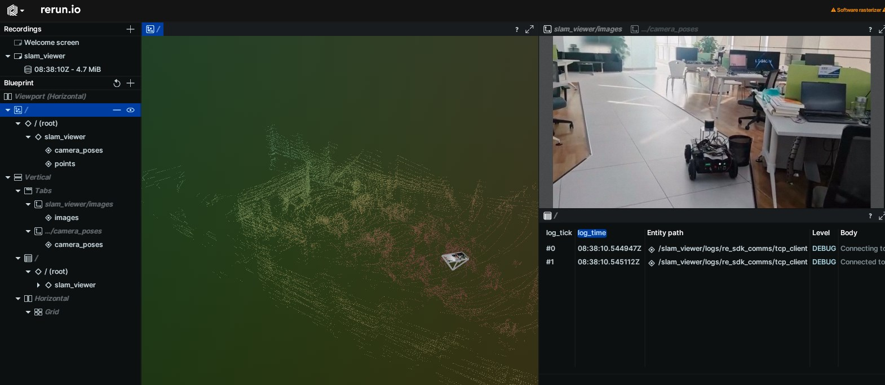

# M-Robots OS调研报告

新闻介绍：[全国首个分布式异构多机协同机器人操作系统M-Robots OS（Multi-Robots OS）1.0正式发布](https://www.dutenews.com/n/article/8785240)

项目官网：[M-Robots - 开源代码托管,代码协作 - AtomGit | GitCode](https://atomgit.com/m-robots)

## 项目简介

M-Robots OS是全国首个基于开源鸿蒙构建的分布式异构多机协同机器人操作系统，具备多机实时协同、多硬件形态兼容、AI原生以及丰富API与开发工具链四大核心能力，为行业提供“底层统一、场景多元”的全栈式系统平台。

多机实时协同：依托分布式软总线、分布式实时通信与调度能力、高并发低时延（中断响应时延≤1 微秒，任务切换时延≤1 微秒）、多内核混合部署，支持多机高效协作。

多硬件形态兼容：通过弹性部署、软硬件解耦、机器人应用开发中间件模块化及接口标准化机制，适配工业机械臂、AGV、人形机器人和无人机等不同形态、不同大小的设备。

AI原生：内置AI框架与算法库，配备智能体开发框架，支持原生AI能力构建，推动机器人从“单体智能”迈向“群体智能”。

作为开源鸿蒙生态的重要延伸，M-Robots OS将开源鸿蒙的分布式技术与机器人场景深度融合，首次实现开源鸿蒙在机器人系统级别的落地应用，拓展国产操作系统的应用边界。

对机器人产业而言，其开源模式将有效降低重复开发成本，推动通用能力沉淀。例如，基于M-Robots OS的分布式软总线能力，不同厂商的机械臂、AGV、人形机器人和无人机等可实现数据共享与能力互通，显著提升群体协作效率。

目前，M-Robots OS已在多个实际场景中完成验证：深开鸿已与哈工大重庆研究院及重庆天罡智能、珞石、汇博、拓斯达、宏大、埃夫特、幻尔、钱江、灵猴、乐聚等多个头部校企建立合作，将M-Robots OS成功应用于工业机械臂、协作机器人、人形机器人、AGV、移动机器人、四足机器人等多类产品形态。

通过系统级人机交互能力，M-Robots OS正在重新定义机器人产业的人机交互范式，为未来Agent驱动下的人机、机机协作打造统一智能入口。

支持所有 **aarch6**4 架构 **OpenHarmony** 开发板比如：**dayu200 64位、rk3588。对Ubuntu20.04适配最好**，可以使用**wsl**或者**vmware虚拟机**。

## 基于激光雷达SLAM技术的自动驾驶应用样例

[applications_sample_cqupt_slam](https://atomgit.com/m-robots/applications_sample_cqupt_slam)

代码仓库：[github.com/ZcanMelo/slam-navigation-robot-catch](https://github.com/ZcanMelo/slam-navigation-robot-catch)

演示视频（24年10月份的）：[Go Sim China 2024: 机械臂与SLAM导航_哔哩哔哩_bilibili](https://www.bilibili.com/video/BV1FhjPziE3Y/?spm_id_from=333.1387.homepage.video_card.click&vd_source=527b2a056137eae394ffeb0651d7207a)

使用文档：[slam-navigation-robot-catch/autonomous_manual.pdf at main · ZcanMelo/slam-navigation-robot-catch](https://github.com/ZcanMelo/slam-navigation-robot-catch/blob/main/autonomous_manual.pdf)

### 简介

CQUPT SLAM 自动驾驶系统是由重庆邮电大学自动化学院汽车电子工程中心智能车辆技术团队开发的一套基于激光雷达 SLAM 的自动驾驶平台。系统整合了感知、定位、建图、路径规划和车辆控制等核心能力，可为自动驾驶车辆提供从环境理解到运动执行的完整闭环解决方案。其源代码托管于仓库 ​*slam-navigation-robot-catch*，整体结构采用模块化架构，便于维护与扩展。

在感知层面，系统支持 RoboSense 激光雷达的数据采集处理，并集成了 WitHighModbus HWT9073485 IMU 传感器，用于提供姿态与运动信息。结合这些传感器，系统在定位与建图模块中实现了基于 NDT-OMP 的激光雷达 SLAM 算法，能够完成高精度环境建模；同时通过无迹卡尔曼滤波进行位姿估计，并支持 PCD 地图的加载与处理，从而提升定位稳定性。

路径规划部分采用 Frenet 坐标系进行轨迹生成，能够实现高层任务决策、局部路径生成以及车道线检测与跟踪。在动态环境中，系统还具备路径优化与避障能力，以保证车辆在复杂道路上的安全通行。车辆控制方面则集成了 PID 纵向控制器和纯跟踪横向控制器，实现速度调节与转向控制，并可切换多种运行模式，如前进、后退、停止和自动紧急制动等。

为了适应不同的运行需求，CQUPT SLAM 提供了多种数据流配置文件，包括完整系统模式、SLAM 定位模式、激光雷达 SLAM 模式以及基于 PCD 的 SLAM 模式。这些模式均由 YAML 文件进行管理，可根据任务快速切换。技术上，系统具备高精度实时定位（位姿更新可达 100Hz）、智能路径规划和稳定控制策略，并依托 Dora 框架实现模块化与实时数据流处理。

### 使用前注意

基于dora的室内定位导航，想要运行该系统需要用ROS提前建好的PCD点云地图和全局路线。

所需环境：Ubuntu20.04、dora-rs（0.3.8）、ROS1-Noetic、Rerun\_cpp\_sdk 、serial、livox\_sdk。

项目目标是实现以下流程：通过 Whisper 进行语音识别，利用千问大模型提取指令关键词，将关键词传递给机械臂。同时，车辆接收信号后，基于激光 SLAM 完成定位，并结合预设路线进行自主导航。当车辆到达指定位置后，发送信号至机械臂模块，机械臂通过 YOLOv5 进行目标识别并完成抓取任务。

## 基于Rerun的面向SLAM场景的可视化工具

[robot_tools_rerun_tools](https://atomgit.com/m-robots/robot_tools_rerun_tools)

### 介绍

此工具对如下内容进行可视化：

- **雷达点云图**

  - PointsXYZ：点云数据文件（不包含点强度）
  - PointsXYZI：点云数据文件（包含点强度）
- ​**图像（Image）** ：支持未压缩和压缩图像。

  - 未压缩图像类型主要基于张量（Tensor）和数据的形状（shape），支持以下几种类型的未压缩图像：

    - 灰度图像（单通道）
    - RGB 图像（三通道）
    - RGBA 图像（四通道）
  - 除了上述未压缩的图像格式外，也支持以下几种类型的压缩格式的图像数据。

    - JPEG
    - Nv12
    - YUY2
- **小车运动轨迹（Trajectory）**
- **相机姿态（Camera Poses）**
- **RGBD图像**：数据集包含同步RGB和深度帧对  
  数据集地址：[https://cs.nyu.edu/~silberman/datasets/nyu_depth_v2.html](https://cs.nyu.edu/~silberman/datasets/nyu_depth_v2.html)

### 使用前须知

系统：M-Robots/OpenHarmony aarch64、Ubuntu x86-64系统

运行示例效果展示：



## Ferrium

[robot_tools_ferrium](https://atomgit.com/m-robots/robot_tools_ferrium)，[用户手册](https://atomgit.com/m-robots/robot_tools_ferrium/blob/master/docs/zh/README_zh.md)，[软件包仓库](https://atomgit.com/m-robots/robot_tools_ferrium_pkgs)

Ferrium 是一个用 Rust 编写的强大包管理工具，致力于提供灵活、可靠的包管理解决方案。

### 主要特性

-  **高性能**：采用 Rust 语言开发，支持异步操作，运行高效
-  **依赖管理**：智能的依赖解析系统和构建依赖图
-  **多工具链**：支持配置和切换多个工具链
-  **镜像系统**：支持生成和使用包镜像
-  **状态回滚**：支持将部署状态回滚到之前的版本
-  **多种合并模式**：支持硬链接等多种文件合并方式

## Maestro

[robot_tools_maestro](https://atomgit.com/m-robots/robot_tools_maestro)

maestro 是一个基于Web的机器人可视化编程和调试工具。它提供了一个直观的图形化界面，让用户能够轻松地创建、编辑和调试机器人应用程序

### 介绍

maestro 是一个基于Web的机器人可视化编程和调试工具。它提供了一个直观的图形化界面，让用户能够轻松地创建、编辑和调试机器人应用程序。其界面直观、操作友好，用户可以通过拖拽与图形化编程方式快速构建流程，也可以进行代码级调试，非常适合机器人开发、教学与实验环境。该工具支持 **ROS1、ROS2** 以及新兴的 **Dora 机器人框架**（ros2和dora似乎还处于构建中），并兼容 **Ubuntu** 与 **OpenHarmony** 等多种操作系统，使其在不同机器人生态中均具备良好的实用性。

在运行时监控方面，Maestro 提供对机器人系统状态的实时可视化能力，包括 ROS 节点的状态展示、topic 发布与订阅关系的监控、服务调用管理等。同时，它还能渲染多类型的传感器数据，如图像、激光雷达扫描与点云。

Maestro 还内置一个功能完整的可视化编程环境，用户不仅可以创建和管理自定义节点，还能通过拖拽方式构建节点拓扑图。此外，它提供 JavaScript 代码编辑器以支持更细粒度的逻辑实现，同时允许添加自定义消息类型。

在技术架构上，Maestro 的前端采用现代 Web 技术构建，包括 ES6+、WebGL、Canvas 2D 与 WebSocket 等，以确保界面渲染高效与响应实时。后端则基于 Rust 开发，负责处理系统逻辑、桥接 ROS、维护 WebSocket 通信等功能，并通过 Webpack 进行构建与打包。

### 使用前须知

Web客户端:Node.js 14+、Python 3.8+、现代浏览器（Chrome/Firefox/Safari）  
服务端运行环境:ROS Noetic  
服务端编译环境:Rustc 1.80+

## DORA (Dataflow-Oriented Robotic Architecture) 

[third_party_dora](https://atomgit.com/m-robots/third_party_dora)

[dora官网](https://dora-rs.ai/)

### 介绍

M-Robots dora 三方库是面向 M-Robots 机器人系统的关键组件仓库，用于集成和构建 dora 框架在 M-Robots 机器人生态中的基础能力。该仓库提供了 dora 的核心接口、节点 API、算子 API 以及多语言支持等实现，用户可直接通过仓库源码构建相关组件。

在 **AI** 与机器人技术深度融合的今天，传统机器人框架的性能瓶颈和开发效率问题日益凸显。**dora-rs（Dataflow Oriented Robotics Architecture）（**​[dora官网](https://dora-rs.ai/)​ **）** ​ 应运而生，成为一款基于 **Rust** 语言的高性能、现代化机器人框架。其核心目标是通过数据流驱动的设计范式，解决机器人开发中低效通信、跨语言集成困难等问题，并在性能上实现对 **ROS/ROS2** 等传统框架的超越。

**dora-rs** 采用**有向图数据流范式**，将机器人应用建模为节点（**Node**）和边（**Edge**）组成的网络。节点代表独立任务（如传感器处理、运动控制），边定义数据流向，支持动态组合与分布式部署。这种设计使得系统模块化程度高，开发者可通过 YAML 配置文件快速调整数据流逻辑，无需修改底层代码。

节点（Node） ：独立进程，通过共享内存或 TCP 通信，支持 Python、Rust、C/C++ 等多种语言实现。  
算子（Operators） ：轻量级协作组件，由运行时调度，支持优先级任务和本地截止时间管理。  
协调器（Coordinator） ：负责解析数据流配置、部署节点，并监控运行状态，支持集群管理与自动扩缩容

零拷贝传输：基于自研共享内存服务器和 **Apache Arrow** 内存格式，跨进程传递数据时避免拷贝开销，单机通信延迟低至 4.49ms（40MB 数据）。  
跨平台支持：本地通信采用共享内存，分布式场景通过 **Zenoh** 中间件或 **TCP** 实现，兼容 **Windows、Linux、macOS** 及 **ARM** 架构。

## Robot Middleware

[robot_middleware](https://atomgit.com/m-robots/robot_middleware)，[框架架构](https://atomgit.com/m-robots/robot_middleware/blob/master/docs/framework/README.md)，[示例代码](https://atomgit.com/m-robots/robot_middleware/blob/master/docs/examples/README.md) ，[测试指南](https://atomgit.com/m-robots/robot_middleware/blob/master/docs/tests/README.md)

### 介绍

Robot Middleware 是开源鸿蒙机器人核心子系统，机器人操作系统中间件框架，为应用提供了统一编程接口，包括机器人通信和消息传递等功能。

项目结构

```undefined
项目结构
robot_middleware/
├── framework/          # 核心框架实现
├── interfaces/         # 多语言接口定义
├── examples/           # 示例代码
├── idl/                # 接口定义语言文件
├── impl/               # 具体实现
├── sa/                 # 系统服务
├── tests/              # 测试代码
└── docs/               # 项目文档
```

Robot Middleware 目前已经支持基于 **Dora** 的高性能实时数据流通信，使其能够在低延迟场景下进行稳定且高吞吐的数据交换。对于机器人领域广泛使用的 ROS 和 ROS2，系统正在构建相应的通信支持，以实现与主流生态的直接兼容。

当前已规划包括 C++、JavaScript、Rust 和 ArkTS 在内的多语言支持，其中 C++ 和 ArkTS 已具备基础的订阅发布能力，其余语言也在持续开发中。

### 架构层次

```undefined
┌───────────────────────────────────────────────────────────────────────────────┐
│                            应用层 Application Layer                            │
├───────────────────────────────────────────────────────────────────────────────┤
│                           接口层 Interface Layer                               │
│  ┌─────────────┬─────────────┬─────────────┬─────────────┬─────────────┐      │
│  │     C++     │ JavaScript  │     Rust    │    ArkTS    │   Python    │      │
│  └─────────────┴─────────────┴─────────────┴─────────────┴─────────────┘      │
├───────────────────────────────────────────────────────────────────────────────┤
│                            核心层 Core Layer                                   │
│  ┌──────────────────────────────────┬─────────────────────────────────┐       │
│  │         Transport                │         Message                 │       │
│  └──────────────────────────────────┴─────────────────────────────────┘       │
├───────────────────────────────────────────────────────────────────────────────┤
│                          实现层 Implementation Layer                           │
│      ┌─────────────┬─────────────┬─────────────┬─────────────┐                │
│      │    Dora     │     ROS     │    ROS2     │   Others    │                │
│      └─────────────┴─────────────┴─────────────┴─────────────┘                │
└───────────────────────────────────────────────────────────────────────────────┘
```

‍